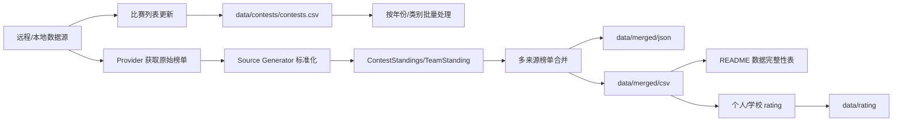

# XCPC Standings 仓库架构与算法分析

## 1. 项目定位

本仓库用于汇总 ICPC/CCPC 等 XCPC 赛事的终榜数据。它从 XCPCIO、Rankland、PTA、历史归档 CSV 等来源获取比赛列表与榜单数据，将不同来源解析成统一的中间模型，再合并生成标准 JSON/CSV，并基于合并后的榜单计算个人和学校 rating。

整体处理链路如下：



## 2. 目录与模块职责

### 2.1 顶层入口

- `main.py` 是唯一 CLI 入口，提供 `update`、`merge`、`rating`、`readme` 四个子命令。
- `README.md` 说明使用方式，并展示当前已合并榜单的数据完整性。
- `data/` 存放配置、比赛列表、原始缓存、标准化中间文件、合并结果和 rating 结果。
- `src/` 存放核心业务代码。

### 2.2 核心源码模块

- `src/models.py` 定义统一数据模型和排名重算逻辑。
- `src/update_contests.py` 获取并合并比赛元数据，输出 `data/contests/contests.csv`。
- `src/providers.py` 封装不同数据源的获取、缓存、解析流程。
- `src/sources/*.py` 负责把各来源原始格式解析为统一 standings JSON。
- `src/merge_standings.py` 负责多来源榜单合并、冲突检测、学校名歧义处理、最终 CSV/JSON 输出。
- `src/rating/calculator.py` 基于合并 CSV 计算个人榜和学校榜 rating。
- `src/rating/utils.py` 实现 rating 数学模型、姓名规范化和颜色分级。
- `src/readme.py` 扫描合并 CSV，重新生成 README 的数据完整性表。
- `src/utils/http.py` 提供带重试的 HTTP 文本/JSON 获取。
- `src/utils/text.py` 提供文本规整、中文检测、姓名拼音集合。
- `src/utils/school.py` 基于 `data/config/school.json` 做学校名规范化与歧义检测。

## 3. 统一数据模型

仓库将所有来源统一到 `ContestStandings -> TeamStanding -> ProblemStatus` 三层模型。

### 3.1 ProblemStatus

`ProblemStatus` 描述单队单题状态：

- `solved`：是否 AC。
- `tries`：AC 前错误提交数；若未 AC，则表示有效错误提交数。
- `time_mins`：AC 时间，单位分钟。

该结构屏蔽了不同来源对题目状态的表示差异。例如 XCPCIO 来自 run 流，Rankland 来自 `statuses`，Archive 来自 `+(time)`、`+k(time)`、`-k` 等字符串，PTA 来自每题详情字段。

### 3.2 TeamStanding

`TeamStanding` 是单支队伍的标准记录，主要字段包括：

- 队伍与组织信息：`team_name`、`school`、`member1-3`、`coach`。
- 排名信息：`rank`、`school_rank`、`_unofficial_rank`。
- 成绩信息：`score`、`penalty`、`medal`、`problem_scores`。
- 队伍属性：`is_official`、`is_girl`。

`get_sort_key()` 是标准排序关键：

1. 解题数降序。
2. 罚时升序。
3. 已 AC 题目的 AC 时间列表降序。
4. 队名、学校、成员名作为稳定兜底排序，其中队名优先用于贴近 XCPCIO 与 Rankland 对 0 题队伍的展示顺序。

第三项使用降序 AC 时间列表，是为了在 solved 和 penalty 相同的情况下得到可重复的排序结果，但它并不完全等同所有正式榜单的细则；更像是仓库内部的确定性排序补充。

### 3.3 ContestStandings

`ContestStandings` 包含比赛名称、题号列表和队伍 standings。所有来源解析器最终都返回该结构的字典形式。

### 3.4 标准排名重算

`calculate_canonical_ranks()` 会对队伍重新排序并赋 rank：

- 官方队伍获得连续 `rank`。
- 非官方队伍 `rank = None`，同时写入内部 `_unofficial_rank`，用于合并时匹配非官方队伍。
- `school_rank` 只给每所学校首次出现的官方队伍，重复学校的后续队伍为 `None`。
- 学校 rank 使用 `school.strip().lower()` 去重，最终名称规范化主要由 `src/utils/school.py` 负责。

## 4. CLI 工作流

`main.py` 使用 argparse 分发命令：

- `python main.py update` 调用 `src.update_contests.main()`，更新比赛列表。
- `python main.py merge --batch --years 2025` 调用 `batch_process()`，批量生成合并榜单。
- `python main.py merge base comp out` 手工合并两个标准 JSON。
- `python main.py rating --type all` 调用 rating 模块生成个人/学校 rating。
- `python main.py readme` 调用 README 生成器。

该设计把用户操作压缩到统一入口，但各业务模块仍可独立运行，便于调试。

## 5. 数据获取与比赛列表合并

比赛列表更新由 `src/update_contests.py` 完成。它的目标不是获取榜单明细，而是建立统一的赛事索引 `data/contests/contests.csv`。

### 5.1 XCPCIO 比赛列表

`parse_xcpcio()` 请求：

```text
https://board.xcpcio.com/data/index/contest_list.json
```

解析逻辑：

- 只处理 `icpc`、`ccpc`、`provincial-contest`、`camp` 等主要分组。
- ICPC 年份与届数换算：`ordinal = year - 1975`。
- CCPC 年份与届数换算：`ordinal = year - 2014`。
- `start_time` 支持秒级或毫秒级时间戳，统一格式化为 `YYYY-MM-DD`。
- `id` 使用 `board_link` 去掉开头 `/` 后的路径。

### 5.2 Rankland 比赛列表

`parse_rankland()` 请求：

```text
https://raw.githubusercontent.com/algoux/srk-collection/master/official/config.yaml
```

解析逻辑：

- 从 YAML 的 `root.children` 递归读取 ICPC/CCPC 分组。
- 从组名或比赛名中识别年份。
- 从比赛名开头的日期片段识别 `date`。
- `id` 使用 Rankland 配置中的 `path`，后续再通过 `parse_rankland_config()` 转换成实际下载路径的 `(category, year)`。

### 5.3 Archive 历史归档

`parse_archive()` 读取本地：

- `data/raw/cache/archive/csv/*.csv`
- `data/raw/cache/archive/date.csv`

文件名约定为：

```text
{ordinal}_{series}_{name}.csv
```

算法从文件名恢复届数、系列、比赛名，再按 ICPC/CCPC 的年份偏移恢复年份。日期从 `date.csv` 补充，并把 `YYYY/M/D` 规范化为 `YYYY-MM-DD`。

### 5.4 PTA 比赛列表

`parse_pintia()` 通过 `PtaDataSource.get_contest_list()` 请求 PTA 公开比赛列表，过滤热身赛和测试赛。

识别逻辑包括：

- 从比赛名判断 CCPC/ICPC/Other。
- 从日期或标题中的 `20xx` 提取年份。
- 从 `第x届` 中文数字解析届数。
- 若识别出系列与届数，则反推出年份。

### 5.5 比赛类别识别

`get_category()` 根据来源 id 和比赛名归类：

- `Warmup`
- `Girls`
- `Vocational`
- `Online`
- `Invitational`
- `Final`
- `Provincial`
- `Camp`
- `Regional`
- `Regular`

该函数是后续批量 merge 和 rating 的关键过滤依据。

### 5.6 赛事名规范化与多来源合并

`get_name_id()` 生成跨来源稳定的赛事短名：

- 优先用 `data/config/zh_to_en.json` 把中文地名替换为英文短名。
- 移除 ICPC/CCPC、年份、届数、常见赛事后缀、标点等噪声。
- 网络赛会统一替换为 `online`。
- PTA 的 `Other` 系列保留较完整名称，只删除文件系统非法字符。

`merge_contests()` 使用如下 key 合并来源：

```text
(year, series, category, name_id)
```

同一 key 下分别填入 `xcpcio_id`、`rankland_id`、`archive_id`、`pta_id`。这样可以在某个来源缺日期或名称略有差异时仍尽量合并到同一赛事。

### 5.7 输出

比赛列表最终写入：

```text
data/contests/contests.csv
```

字段包括：

```text
series, year, ordinal, date, category, name, xcpcio_id, rankland_id, pta_id, archive_id
```

排序按日期倒序，缺失日期排在较后位置。

## 6. Provider 与缓存层

`src/providers.py` 为榜单明细获取提供统一抽象。

### 6.1 BaseProvider

`BaseProvider` 定义通用接口：

- `is_valid()` 判断来源 id 是否可用。
- `fetch_raw()` 获取原始数据。
- `parse_standard()` 转标准 JSON。
- `get_standings()` 获取标准榜单。

### 6.2 JSONCacheProvider

`JSONCacheProvider` 实现通用模板流程：

1. 校验 identifier。
2. 调用 `fetch_raw()` 获取原始数据。
3. 调用 `parse_standard()` 转为标准 JSON。
4. 写入 `data/raw/json/{source}/{id}.json`。
5. 返回标准 JSON。

具体来源的原始缓存通常由 source data source 自己写入 `data/raw/cache/{source}`。

### 6.3 四个具体 Provider

- `XCPCIOProvider` 使用 `XCPCIODataSource` 和 `ICPCStandingsGenerator`。
- `RanklandProvider` 使用 `RanklandDataSource` 和 `SRKStandingsGenerator`，额外依赖 `(category, year)`。
- `ArchiveProvider` 读取本地 CSV，只有本地文件存在才有效。
- `PTAProvider` 使用 `PtaDataSource` 和 `PTAStandingsGenerator`。

## 7. 各来源榜单解析算法

### 7.1 XCPCIO 解析

`XCPCIODataSource.fetch_contest_data()` 会缓存并合并：

- `config.json`
- `team.json`
- `run.json`
- `organizations.json`

`ICPCStandingsGenerator.generate()` 的主要算法：

1. 解析 organization，建立 `organization_id -> 学校名` 映射。
2. 遍历 team，提取队名、学校、成员、教练、官方/女队标记。
3. 按 `timestamp` 对 run 流排序，模拟 ICPC 罚时计算。
4. 每题初始为未通过；AC 后忽略该题后续提交。
5. 根据 `config.options.submission_timestamp_unit` 或时间范围启发式把提交时间统一换算为秒，再将每题 AC 时间展示为分钟。
6. 根据 `config.options.calculation_of_penalty` 选择总罚时口径：默认逐题取整到分钟后累加；若为 `accumulate_in_seconds_and_finally_to_the_minute`，则把 AC 秒数和错误罚时秒数相加后，最后统一取整到分钟。
7. 非 pending/compiling/judging/CE/UKE 的非 AC 状态计为错误提交。
8. 根据解题数和罚时排序，结合配置中的奖牌数给官方队伍分配奖牌。
9. 转换为 `TeamStanding` 和 `ProblemStatus`。

CSV 导出使用 `ICPCStandingsGenerator.export_csv()`，题目列格式为：

- `+(time)`：一发 AC。
- `+k(time)`：AC 前有 k 次错误。
- `-k`：未 AC 且有 k 次错误。
- 空：无有效提交。

### 7.2 Rankland 解析

`RanklandDataSource.fetch_contest_data()` 从 srk-collection 读取：

```text
official/{category}/{year}/{contest_id}.srk.json
```

`SRKStandingsGenerator.generate()` 的主要算法：

1. 从 `problems` 提取题目 alias/title。
2. 遍历 `rows`，读取 `user`、`score`、`statuses`。
3. 队名支持多语言结构，优先中文。
4. `teamMembers` 中带 `(教练)` 或 `（教练）` 的成员拆到 coach。
5. 如果只有一个成员对象但包含多个空格分隔姓名，会拆成多名队员。
6. 对特定逗号导致的成员拆分异常做局部修复。
7. `score.value` 为解题数，`score.time` 按 `s`、`ms`、`min` 等单位转分钟作为罚时。
8. 每题 `result` 为 `AC` 或 `FB` 时视为通过，`tries - 1` 作为错误次数。
9. 未通过但有 RJ/WA/TLE/MLE/RTE/PE/CE/UKE 等结果时记录错误次数。
10. 从 `awards` 中粗略识别 Gold/Silver/Bronze/Honorable。

Rankland 的原始 rows 通常已经是终榜顺序，但合并前仍会通过统一排名函数重算，使不同来源处在同一排序规则下。

### 7.3 Archive 解析

`ArchiveDataSource` 直接读取本地 CSV 为 `DictReader` 行列表。

`ArchiveStandingsGenerator.generate()` 的主要算法：

1. 从第一行字段中提取单个大写字母列作为题号。
2. 读取 `Solved`、`Penalty`、`Unofficial`、`Girl`、`Medal` 等列。
3. `Unofficial=Y` 视为非官方，否则默认官方。
4. `Girl=Y/N` 转为布尔或空。
5. 题目状态解析：
   - `-` 表示无错误提交。
   - `-k` 表示 k 次错误未通过。
   - `+(t)` 表示一发通过，时间 t。
   - `+k(t)` 表示通过前 k 次错误，时间 t。
   - `t` 纯数字也视作通过时间。
6. 输出标准 standings。

### 7.4 PTA 解析

`PtaDataSource.fetch_contest_data()` 请求：

```text
https://pintia.cn/api/competitions/{contest_id}/xcpc-rankings/public
```

`PTAStandingsGenerator.generate()` 的主要算法：

1. 从 `problemInfoByProblemSetProblemId` 按 label 排序得到题目顺序。
2. 遍历 `rankings`。
3. 从 `teamInfo` 提取学校、队名、成员、女队、是否 excluded。
4. `excluded=True` 视为非官方。
5. `solvedCount` 和 `solvingTime` 分别作为解题数与罚时。
6. 每题根据 `acceptTime >= 0` 判断 AC。
7. `validSubmitCount` 直接作为 `tries` 写入；这一点与标准模型的“AC 前错误次数”语义略有差异，若 PTA 的该字段包含 AC 提交本身，可能会导致 `+k(time)` 中的 k 偏大。

## 8. 榜单合并算法

榜单合并由 `src/merge_standings.py` 完成，入口是 `batch_process()` 和 `merge_standings()`。

### 8.1 批量处理范围

`batch_process(year_arg)` 读取 `data/contests/contests.csv` 后按年份过滤：

- 单年：`2025`
- 年份范围：`2021-2025`
- 全量：`all`

只处理：

```text
Regional, Final, Online, Girls, Vocational
```

并排除 `worldfinals`。

输出文件名为：

```text
{series}_{year}_{category}_{name}.json
{series}_{year}_{category}_{name}.csv
```

### 8.2 来源优先级

每场比赛会按可用 id 构造 Provider：

1. Archive
2. PTA
3. XCPCIO
4. Rankland

实际合并前会按 base 优先级排序：

```text
XCPCIO -> Rankland -> Archive -> 其他
```

PTA 不在显式优先级表内，因此排序优先级为默认值 99，通常作为补充来源合入。

### 8.3 学校名规范化与歧义处理

学校名处理有两层：

- `get_canonical_school_name()` 返回显示用标准中文名。
- `normalize_school_name()` 返回匹配用标准键。

二者都依赖 `data/config/school.json`。初始化时会把同一别名映射到多个学校的情况记录为 ambiguous。

在批量合并时，如果某队学校名命中歧义别名，会生成 warning，并尝试从 `data/merged/resolutions.csv` 读取人工 Resolution。若存在 Resolution，则直接替换该队学校名。

### 8.4 单次 merge_standings 流程

`merge_standings(base_json, complement_json, source_name, contest_name, resolutions)` 的流程：

1. 将 base 和 complement 转为 `ContestStandings` 对象。
2. 对两边学校名做 canonical 显示名规整。
3. 分别调用 `calculate_canonical_ranks()` 重算官方/非官方排名。
4. 以 complement 的 rank 建立映射：
   - 官方队伍 key 为 `rank`。
   - 非官方队伍 key 为 `U{_unofficial_rank}`。
5. 遍历 base 队伍，用相同 rank 找 complement 候选。
6. 找到候选后按字段合并：`school`、`team_name`、`member1-3`、`coach`、`is_girl`、`is_official`、`score`、`penalty`、`medal`。
7. base 字段为空、complement 非空时直接补值。
8. 两边非空且不同则进入冲突判断。
9. 合并题目状态：若 base 没有该题，或 base 该题未 solved，则使用 complement 的题目状态。
10. complement 中未使用的队伍追加到最终结果。
11. 最终再次 canonical 排名。

### 8.5 冲突识别与自动消解

字段冲突不会立即覆盖，而是先尝试几类自动消解：

- 成员顺序不同但集合相同：视为同一信息，不报冲突。
- 成员/教练拼音相同：视为同一人；如果 complement 是中文、base 不是中文，则保留中文。
- 队名仅差开头的 `*` 或 `★` 标记：视为同一队名，不报冲突；若 base 带标记而 complement 不带标记，则保留不带标记的版本。
- penalty 差值不超过 15：认为可能是取整或来源细节差异，采用 complement 的 penalty。
- 命中 `resolutions.csv` 的人工 Resolution：直接采用 Resolution。

无法自动消解时，会生成 conflict warning，字段包括：

```text
Contest, Rank, School, Team Name, Field, Sources..., Resolution
```

最终批量流程会把冲突写回 `data/merged/resolutions.csv`。人工填写 Resolution 后，下次合并会自动应用。

### 8.6 队伍匹配辅助函数

文件中还定义了 `is_same_team()` 与 `matches_members()`：

- `matches_members()` 将成员名转为拼音集合或规范文本，至少匹配两名或较小成员数。
- `is_same_team()` 先比较学校，再比较队名，最后比较成员。

不过当前 `merge_standings()` 主流程主要按 rank 匹配，这两个辅助函数没有参与主合并路径。它们为未来从“排名匹配”升级为“实体匹配”提供了基础。

### 8.7 合并策略评价

当前策略的优点：

- rank 匹配简单稳定，适合多来源终榜顺序一致的场景。
- 人工 resolution 机制能保留审校结果，后续重复运行不会丢失。
- 学校名和姓名拼音处理能覆盖常见中英文差异。

主要风险：

- 如果两个来源的官方/非官方队伍过滤不同，rank 对齐可能错位。
- 如果某来源缺队伍或多队伍，后续同 rank 可能匹配到错误实体。
- `matches_members()` 尚未用于主流程，无法在 rank 不可靠时兜底。
- PTA 的 `tries` 语义可能与其他来源不完全一致。

## 9. Rating 计算

Rating 由 `src/rating/calculator.py` 和 `src/rating/utils.py` 实现，分为个人 rating 与学校 rating。

### 9.1 比赛日程构建

`build_contest_schedule(rating_type)` 读取 `data/contests/contests.csv`，筛选：

```text
Regional, Final, Invitational, Online, Girls, Vocational
```

只有对应合并 CSV 存在时才纳入日程。

日程按日期升序排列。同一天的比赛会根据类别和系列排序：

```text
Vocational < Girls < Online < Invitational < Regional < Final
CCPC < ICPC
```

个人 rating 中，同一天多场比赛合并成一个展示列，tag 由当日比赛名拼接。学校 rating 中，同一天比赛不合并展示列，而是一场比赛一个列。

### 9.2 Rating 数学模型

`calculateRating(userRank, currentRatings)` 接近 Codeforces/Elo 风格的批量 rating 更新。

输入：

- `userRank`：本场参赛者到排名的映射。
- `currentRatings`：当前 rating，缺省为 1400。

核心函数 `calcSeed(ratingToCounts, rating, prev)` 计算给定 rating 对所有参赛者的期望排名 seed：

```text
seed = 1 + sum(1 / (1 + 10 ^ ((rating - opponent_rating) / 400))) - self_term
```

其中 self term 用 `prev` 排除自己。

单场更新流程：

1. 新用户初始 rating 设为 1400。
2. 统计本场参赛者当前 rating 分布 `ratingToCounts`。
3. 对每个用户计算当前 rating 下的期望 seed。
4. 令目标表现排名 `M = sqrt(seed * actual_rank)`。
5. 二分搜索一个表现 rating，使该表现 rating 的 seed 接近 M。
6. 初始 delta 为 `(performance_rating - old_rating) / 2`。
7. 对全体 delta 做一次零和校正：`inc = -(sum_delta // userCount) - 1`。
8. 代码还计算了 top group 校正 `inc`，但没有实际加回 delta，因此当前实现中 top group 校正变量没有生效。
9. 返回新 rating。

复杂度方面，若本场有 n 个参赛者、不同 rating 桶数量为 m，则每个用户二分约 13 次，每次 seed 计算遍历 m 个桶，总复杂度约 `O(n * log(8000) * m)`。在 rating 值重复较多时 m 小于 n。

### 9.3 个人 Rating

`generate_member_rating()` 的流程：

1. 构建 member 日程。
2. 对每个日期组遍历其中 CSV。
3. 跳过全空行、非官方队伍、零解队伍。
4. 取学校名并标准化。
5. 读取 `Member1-3`，过滤空值、教练后缀。
6. 港澳学校或姓名包含港澳特征时做繁转简。
7. 每名成员以 `(school, member)` 作为唯一用户。
8. 用户 rank 使用队伍 `Rank`。
9. 调用 `calculateRating()` 更新当前 rating。
10. 同一天多场比赛时，用 `pending_diff` 累积 delta，最后以一个日期列展示。
11. 输出 `data/rating/rating_member.csv` 和 `data/rating/rating_member.xlsx`。

个人榜的特点是同队三名成员共享同一队伍 rank，但作为三个独立用户更新 rating。

### 9.4 学校 Rating

`generate_school_rating()` 的流程：

1. 构建 school 日程。
2. 对每个比赛 CSV 单独处理。
3. 若 CSV 中是 `Organization`/`Organization Rank`，会重命名为 `School`/`School Rank`。
4. 如果缺少 `School Rank`，按 CSV 中每所学校首次出现顺序生成学校 rank。
5. 跳过全空行、非官方队伍、无 school rank 队伍、零解队伍。
6. 学校名标准化后，以学校名作为用户。
7. 每所学校使用其 `School Rank` 更新 rating。
8. 输出 `data/rating/rating_school.csv` 和 `data/rating/rating_school.xlsx`。

学校榜本质上把学校作为选手，使用每场比赛的学校排名参与同一套 rating 更新。

### 9.5 Rating 输出着色

`rating_color()` 在 xlsx 中按 rating 分段着色：

- `<1200` 灰色。
- `<1400` 绿色。
- `<1600` 青色。
- `<1900` 蓝色。
- `<2100` 紫色。
- `<2400` 黄色。
- `>=2400` 红色。

CSV 是纯数据；XLSX 使用 pandas Styler 输出样式。

## 10. README 生成

`src/readme.py` 用于生成 README 的数据完整性表。

流程：

1. 读取 `data/config/zh_to_en.json`，构造英文短名到中文名的映射。
2. 读取 `data/contests/contests.csv`。
3. 对每条赛事记录拼出合并 CSV 文件名。
4. 若文件存在，则检查 CSV header 是否包含关键字段：Rank、School、Team、Solved、Penalty、Medal、Problem、Members。
5. 采样前 50 行判断学校和成员列是否包含中文。
6. 按日期倒序生成 Markdown 表格。
7. 写入 `readme.md`。

需要注意的是，当前仓库文件名显示为 `README.md`，而脚本写入的是小写 `readme.md`。在 Windows 上二者通常指向同一文件，但在大小写敏感文件系统上可能产生新文件或行为差异。

## 11. 工程质量观察

### 11.1 设计优点

- 标准模型清晰，来源解析与合并逻辑边界明确。
- Provider 层把“获取、缓存、标准化”串成模板流程，新增来源相对容易。
- `resolutions.csv` 把人工审校结果沉淀为数据，而不是散落在代码里。
- 学校名配置和文本规范化集中在 utils，便于持续补全。
- CLI 使用统一入口，适合日常批处理。

### 11.2 可维护性风险

- 合并主算法主要按 rank 对齐，实体匹配函数尚未真正用于兜底。
- 部分来源差异通过特例代码处理，长期建议迁移到数据修正规则表。
- PTA 题目提交次数语义需要核对，否则可能影响题目列展示和来源冲突判断。
- `calculateRating()` 中 top group 校正变量计算后未应用，可能是遗漏。
- `update_contests.py` 中 `merge_contests()` 对 `pta` 有重复分支，虽然不影响结果，但可清理。
- 缺少自动化测试；榜单合并和 rating 都适合用小型 fixtures 固化回归样例。
- README 生成大小写文件名在跨平台时存在隐患。

### 11.3 建议的后续改进

1. 为 `merge_standings()` 增加 rank 不一致时的队名/学校/成员实体匹配兜底。
2. 为各来源解析器建立 fixture 测试，覆盖 AC、罚时、非官方、女队、成员拆分等边界。
3. 明确 PTA `validSubmitCount` 是否包含 AC 提交，并统一为标准模型的“AC 前错误次数”。
4. 修复或删除 rating top group 校正中的未使用 `inc`。
5. 统一 README 输出文件名为 `README.md`。
6. 在 `resolutions.csv` 中保留来源值的同时，可增加冲突类别或处理状态，便于人工审查。

## 12. 端到端数据流总结

从一次常规更新到生成 rating，完整流程可以概括为：

1. `python main.py update` 从多个来源拉取比赛列表，生成统一赛事索引。
2. `python main.py merge --batch --years 2025` 根据赛事索引找到可用来源，获取原始榜单并缓存。
3. 每个来源解析器把原始数据转换成 `ContestStandings`。
4. 合并器按来源优先级选择 base，用 rank 和冲突规则折叠其他来源。
5. 冲突写入 `data/merged/resolutions.csv`，人工填 Resolution 后可重复运行修正。
6. 合并结果输出到 `data/merged/json` 和 `data/merged/csv`。
7. `python main.py rating --type all` 读取合并 CSV，按赛程顺序更新个人和学校 rating。
8. `python main.py readme` 扫描合并 CSV，更新 README 的数据完整性概览。

该仓库的核心价值在于把多个格式、多个来源、多个年份的 XCPC 榜单整理为可重复生成的统一数据资产；算法重点集中在来源标准化、学校/姓名规整、多来源冲突处理和 rating 序列更新四个环节。