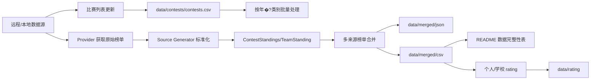

# XCPC Standings 仓库架构与算法分�?

## 1. 项目定位

本仓库用于汇�?ICPC/CCPC �?XCPC 赛事的终榜数据。它�?XCPCIO、Rankland、PTA、历史归�?CSV 等来源获取比赛列表与榜单数据，将不同来源解析成统一的中间模型，再合并生成标�?JSON/CSV，并基于合并后的榜单计算个人和学�?rating�?

整体处理链路如下�?


```mermaid
flowchart LR
    A[远程/本地数据源] --> B[比赛列表更新]
    B --> C[data/contests/contests.csv]
    C --> D[按年�?类别批量处理]
    A --> E[Provider 获取原始榜单]
    E --> F[Source Generator 标准化]
    F --> G[ContestStandings/TeamStanding]
    G --> H[多来源榜单合并]
    H --> I[data/merged/json]
    H --> J[data/merged/csv]
    J --> K[README 数据完整性表]
    J --> L[个人/学校 rating]
    L --> M[data/rating]
```

## 2. 目录与模块职�?

### 2.1 顶层入口

- `main.py` 是唯一 CLI 入口，提�?`update`、`merge`、`rating`、`readme` 四个子命令�?
- `README.md` 说明使用方式，并展示当前已合并榜单的数据完整性�?
- `data/` 存放配置、比赛列表、原始缓存、标准化中间文件、合并结果和 rating 结果�?
- `src/` 存放核心业务代码�?

### 2.2 核心源码模块

- `src/models.py` 定义统一数据模型和排名重算逻辑�?
- `src/update_contests.py` 获取并合并比赛元数据，输�?`data/contests/contests.csv`�?
- `src/providers.py` 封装不同数据源的获取、缓存、解析流程�?
- `src/sources/*.py` 负责把各来源原始格式解析为统一 standings JSON�?
- `src/merge_standings.py` 负责多来源榜单合并、冲突检测、学校名歧义处理、最�?CSV/JSON 输出�?
- `src/rating/calculator.py` 基于合并 CSV 计算个人榜和学校�?rating�?
- `src/rating/utils.py` 实现 rating 数学模型、姓名规范化和颜色分级�?
- `src/readme.py` 扫描合并 CSV，重新生�?README 的数据完整性表�?
- `src/utils/http.py` 提供带重试的 HTTP 文本/JSON 获取�?
- `src/utils/text.py` 提供文本规整、中文检测、姓名拼音集合�?
- `src/utils/school.py` 基于 `data/config/school.json` 做学校名规范化与歧义检测�?

## 3. 统一数据模型

仓库将所有来源统一�?`ContestStandings -> TeamStanding -> ProblemStatus` 三层模型�?

### 3.1 ProblemStatus

`ProblemStatus` 描述单队单题状态：

- `solved`：是�?AC�?
- `tries`：AC 前错误提交数；若�?AC，则表示有效错误提交数�?
- `time_mins`：AC 时间，单位分钟�?

该结构屏蔽了不同来源对题目状态的表示差异。例�?XCPCIO 来自 run 流，Rankland 来自 `statuses`，Archive 来自 `+(time)`、`+k(time)`、`-k` 等字符串，PTA 来自每题详情字段�?

### 3.2 TeamStanding

`TeamStanding` 是单支队伍的标准记录，主要字段包括：

- 队伍与组织信息：`team_name`、`school`、`member1-3`、`coach`�?
- 排名信息：`rank`、`school_rank`、`_unofficial_rank`�?
- 成绩信息：`score`、`penalty`、`medal`、`problem_scores`�?
- 队伍属性：`is_official`、`is_girl`�?

`get_sort_key()` 是标准排序关键：

1. 解题数降序�?
2. 罚时升序�?
3. �?AC 题目�?AC 时间列表降序�?
4. 队名、学校、成员名作为稳定兜底排序，其中队名优先用于贴�?XCPCIO �?Rankland �?0 题队伍的展示顺序�?

第三项使用降�?AC 时间列表，是为了�?solved �?penalty 相同的情况下得到可重复的排序结果，但它并不完全等同所有正式榜单的细则；更像是仓库内部的确定性排序补充�?

### 3.3 ContestStandings

`ContestStandings` 包含比赛名称、题号列表和队伍 standings。所有来源解析器最终都返回该结构的字典形式�?

### 3.4 标准排名重算

`calculate_canonical_ranks()` 会对队伍重新排序并赋 rank�?

- 官方队伍获得连续 `rank`�?
- 非官方队�?`rank = None`，同时写入内�?`_unofficial_rank`，用于合并时匹配非官方队伍�?
- `school_rank` 只给每所学校首次出现的官方队伍，重复学校的后续队伍为 `None`�?
- 学校 rank 使用 `school.strip().lower()` 去重，最终名称规范化主要�?`src/utils/school.py` 负责�?

## 4. CLI 工作�?

`main.py` 保留 argparse 命令行用法；如果直接运行 `python main.py` 且不带任何参数，则进入终端交互界面，可用方向键选择功能、切换配置并执行。交互界面复用同一套业务入口，不应破坏原有命令行参数兼容性�?

命令行子命令包括�?

- `python main.py update` 调用 `src.update_contests.main()`，更新比赛列表�?
- `python main.py merge --batch --years 2025` 调用 `batch_process()`，批量生成合并榜单�?
- `python main.py merge base comp out` 手工合并两个标准 JSON�?
- `python main.py rating --type all` 调用 rating 模块生成个人/学校 rating�?
- `python main.py readme` 调用 README 生成器�?

该设计把用户操作压缩到统一入口，但各业务模块仍可独立运行，便于调试；交互界面主要用于日常更新、批量合并、rating �?README 生成等常规操作�?

## 5. 数据获取与比赛列表合�?

比赛列表更新�?`src/update_contests.py` 完成。它的目标不是获取榜单明细，而是建立统一的赛事索�?`data/contests/contests.csv`�?

### 5.1 XCPCIO 比赛列表

`parse_xcpcio()` 请求�?

```text
https://board.xcpcio.com/data/index/contest_list.json
```

解析逻辑�?

- 只处�?`icpc`、`ccpc`、`provincial-contest`、`camp` 等主要分组，并把原始分组写入内部字段 `source_category`�?
- ICPC 年份与届数换算：`ordinal = year - 1975`�?
- CCPC 年份与届数换算：`ordinal = year - 2014`�?
- `start_time` 支持秒级或毫秒级时间戳，统一格式化为 `YYYY-MM-DD`�?
- `id` 使用 `board_link` 去掉开�?`/` 后的路径�?
- `provincial-contest` �?`camp` 可直接参与类别识别，�?`Warmup` 仍优先覆盖来源类别�?

### 5.2 Rankland 比赛列表

`parse_rankland()` 请求�?

```text
https://raw.githubusercontent.com/algoux/srk-collection/master/official/config.yaml
```

解析逻辑�?

- �?YAML �?`root.children` 递归读取分组，并把沿途父�?`path/name` 规范为内�?`source_category`�?
- `icpc`、`ccpc` 用于区分 `series`；`provincial`、`school` 等非 ICPC/CCPC 分组保持 `series=Other`，并可直接作为比赛类别来源�?
- 省赛、校赛等 Rankland 条目可能位于多层目录下，例如 `省赛 -> 北京市赛 -> bjcpc2026`，解析时需要继承父�?`source_category`，不能只看叶子节点的 id/name�?
- Rankland 叶子记录还会携带父级中文分组名作�?`source_context`，用于后续把 `bjcpc`、`zjcpc`、`sccpc` 等缩写还原为省市英文名�?
- 只从带子节点的分组名/path 中继承来源年份；叶子节点比赛名开头的日期只作�?`date`，不能覆盖父级赛季年份。例�?`ICPC 2025 -> 2026-02-02 EC Final` 仍属�?2025 赛季�?
- 从比赛名开头的日期片段识别 `date`，但不会把日期年份提前写�?ICPC/CCPC 的赛季年份；赛季年份统一在合并阶段按类别规整�?
- `id` 使用 Rankland 配置中的 `path`，后续再通过 `parse_rankland_config()` 转换成实际下载路径的 `(category, year)`�?

### 5.3 Archive 历史归档

`parse_archive()` 读取本地�?

- `data/raw/cache/archive/csv/*.csv`
- `data/raw/cache/archive/date.csv`

文件名约定为�?

```text
{ordinal}_{series}_{name}.csv
```

算法从文件名恢复届数、系列、比赛名，再�?ICPC/CCPC 的年份偏移恢复年份。日期从 `date.csv` 补充，并�?`YYYY/M/D` 规范化为 `YYYY-MM-DD`�?

### 5.4 PTA 比赛列表

`parse_pintia()` 通过 `PtaDataSource.get_contest_list()` 请求 PTA 公开比赛列表，过滤热身赛和测试赛�?

识别逻辑包括�?

- 从比赛名判断 CCPC/ICPC/Other�?
- 从标题中�?`20xx` 提取显式赛季年份；日期年份只保留�?`date`，最终是否用�?`year` 由合并阶段按类别决定�?
- �?`第x届` 解析届数，其中中文数字解析支�?`十` 以上的常见复合写法，例如 `二十一`、`一百零三`�?
- ICPC/CCPC �?Regional/Final 不使用日期年份推断赛季年份，避免 2025 赛季比赛�?2026 年初举行时被误归�?2026�?

### 5.5 比赛类别识别

`get_category()` 使用分层策略归类�?

1. 先用来源 id 和比赛名判断 `Warmup`，保证热身赛、测试赛可以覆盖来源自带分组�?
2. 再使用规范化后的 `source_category` 直接识别 `Camp`、`Provincial`、`School`�?
3. �?ICPC/CCPC 或没有可靠来源类别的数据，继续用来源 id 和比赛名关键词识别细分类别�?
4. 关键词判断统一同时检�?id �?name，避免同类规则一部分只看 id、一部分只看 name�?

Rankland �?`hv` 通常表示高职专场，因�?id �?`hv` 或以 `hv` 结尾�?CCPC 记录会归�?`Vocational`�?

当前类别包括�?

- `Warmup`
- `Girls`
- `Vocational`
- `Online`
- `Preliminary`
- `Invitational`
- `Final`
- `Provincial`
- `Camp`
- `School`
- `Regional`
- `Regular`

该函数是后续批量 merge �?rating 的关键过滤依据�?

年份与届数在 `merge_contests()` 中根据已识别类别统一规整�?

- ICPC/CCPC �?`Regional` �?`Final` 使用严格对应关系：`ICPC year = ordinal + 1975`，`CCPC year = ordinal + 2014`。若只拿�?year �?ordinal 中的一项，则用对应关系补另一项；不使用日期年份推断�?
- 英文序数（如 `49th`）也可作为标题届数来源；`World Finals` 标题中的英文届数优先用于校正赛季，避免相邻届 World Finals 因同�?`worldfinals` 被误合并�?
- 统一优先级为：数据源分类/路径直接给出�?year �?ordinal，其次是标题中的届数，其次是标题中的年份，最后才是实际比赛日期�?
- 这样可以正确处理�?025 赛季比赛�?2026 年初举办”的 Regional/Final；对于省赛、校赛、训练营�?Other 类赛事，日期只在来源结构与标题都无法提供年份时兜底�?

### 5.6 赛事名规范化与多来源合并

`get_name_id()` 生成跨来源稳定的赛事短名�?

- 优先�?`data/config/zh_to_en.json` 把中文地名替换为英文短名�?
- 2025�?026 年的 `Provincial` 比赛会优先在比赛名、Rankland 父级上下文和 id 中查�?`zh_to_en.json` 关键词，并把 `name` 规范成对应省/�?地区英文，例�?`bjcpc -> beijing`、`zjcpc -> zhejiang`、`nmcpc -> neimenggu`。其他年份暂不改动�?
- 2025�?026 年的 `Provincial` 合并 key 会额外带上日期，因此同一省份同一年可以有多场比赛；输�?`name` 仍只写省/�?地区英文，不通过 `icpc`/`ccpc` 后缀区分�?
- PTA 上的 `Invitational` �?`Preliminary` 比赛会尽量根据标题中的中文地名生成英文短名；标题含“预赛”时归入 `Preliminary` 类别，name 只写地名，例如广东邀请赛预赛写作 `category=Preliminary, name=guangdong`�?
- 英文别名会做少量规范化，例如 `northeastern` �?`northeast` 统一�?`northeast`，用于合并同一 CCPC 邀请赛的不同来源命名；不同类别的同名赛事仍保持独立，例如东北邀请赛和东北地区省赛不会合并�?
- 移除 ICPC/CCPC、年份、届数、常见赛事后缀、标点等噪声�?
- 网络赛会统一替换�?`online`；`online-qualification-1/2` 和中文“网络预选赛第一�?第二场”会规整�?`online1`、`online2`。反向展示中文时使用 `online -> 网络赛`，因�?`online1`、`online2` 会显示为 `网络�?`、`网络�?`�?
- PTA �?`Other` 系列保留较完整名称，只删除文件系统非法字符�?
- 如果某场比赛只有 PTA 一个来源，且不属于上述明确要求规范短名的类别，�?`contests.csv` 中的 `name` 使用 PTA 原始全名的安全文件名版本，避免单源比赛被清洗成语义奇怪的短名�?
- 如果类别�?`Girls` 且清洗后的短名为空，则默认写�?`girls`；`Vocational` 类别统一写为 `vocational`，避�?`contests.csv` 和后续合并输出生成空 name 或全名�?

`merge_contests()` 通常使用如下 key 合并来源�?

```text
(year, series, category, name_id)
```

同一 key 下分别填�?`xcpcio_id`、`rankland_id`、`archive_id`、`pta_id`。这样可以在某个来源缺日期或名称略有差异时仍尽量合并到同一赛事�?

2025�?026 �?`Provincial` 比赛使用 `(year, series, category, name_id, date)`，用日期区分同省同年的多场省赛�?

### 5.7 输出

比赛列表最终写入：

```text
data/contests/contests.csv
```

字段包括�?

```text
series, year, ordinal, date, category, name, xcpcio_id, rankland_id, pta_id, archive_id
```

排序按日期倒序，缺失日期排在较后位置�?

## 6. Provider 与缓存层

`src/providers.py` 为榜单明细获取提供统一抽象�?

### 6.1 BaseProvider

`BaseProvider` 定义通用接口�?

- `is_valid()` 判断来源 id 是否可用�?
- `fetch_raw()` 获取原始数据�?
- `parse_standard()` 转标�?JSON�?
- `get_standings()` 获取标准榜单�?

### 6.2 JSONCacheProvider

`JSONCacheProvider` 实现通用模板流程�?

1. 校验 identifier�?
2. 调用 `fetch_raw()` 获取原始数据�?
3. 调用 `parse_standard()` 转为标准 JSON�?
4. 写入 `data/raw/json/{source}/{id}.json`�?
5. 返回标准 JSON�?

具体来源的原始缓存通常�?source data source 自己写入 `data/raw/cache/{source}`�?

### 6.3 具体 Provider

- `XCPCIOProvider` 使用 `XCPCIODataSource` �?`ICPCStandingsGenerator`�?
- `RanklandProvider` 使用 `RanklandDataSource` �?`SRKStandingsGenerator`，额外依�?`(category, year)`�?
- `ArchiveProvider` 读取本地 CSV，只有本地文件存在才有效�?
- `PTAProvider` 使用 `PtaDataSource` �?`PTAStandingsGenerator`�?
- `PDFProvider` 读取本地 `data/raw/cache/pdf` 下的参赛手册 PDF。PDF 通常只含参赛名单，不含成绩，因此作为 roster-only 来源参与合并�?

## 7. 各来源榜单解析算�?

### 7.1 XCPCIO 解析

`XCPCIODataSource.fetch_contest_data()` 会缓存并合并�?

- `config.json`
- `team.json`
- `run.json`
- `organizations.json`

`ICPCStandingsGenerator.generate()` 的主要算法：

1. 解析 organization，建�?`organization_id -> 学校名` 映射�?
2. 遍历 team，提取队名、学校、成员、教练、官�?女队标记�?
3. �?`timestamp` �?run 流排序，模拟 ICPC 罚时计算�?
4. 每题初始为未通过；AC 后忽略该题后续提交�?
5. 根据 `config.options.submission_timestamp_unit` 或时间范围启发式把提交时间统一换算为秒，再将每�?AC 时间展示为分钟�?
6. 根据 `config.options.calculation_of_penalty` 选择总罚时口径：默认逐题取整到分钟后累加；若�?`accumulate_in_seconds_and_finally_to_the_minute`，则�?AC 秒数和错误罚时秒数相加后，最后统一取整到分钟�?
7. �?pending/compiling/judging/CE/UKE 的非 AC 状态计为错误提交�?
8. 根据解题数和罚时排序，结合配置中的奖牌数给官方队伍分配奖牌�?
9. 转换�?`TeamStanding` �?`ProblemStatus`�?

CSV 导出使用 `ICPCStandingsGenerator.export_csv()`，题目列格式为：

- `+(time)`：一�?AC�?
- `+k(time)`：AC 前有 k 次错误�?
- `-k`：未 AC 且有 k 次错误�?
- 空：无有效提交�?

### 7.2 Rankland 解析

`RanklandDataSource.fetch_contest_data()` �?srk-collection 读取�?

```text
official/{category}/{year}/{contest_id}.srk.json
```

`SRKStandingsGenerator.generate()` 的主要算法：

1. �?`problems` 提取题目 alias/title�?
2. 遍历 `rows`，读�?`user`、`score`、`statuses`�?
3. 队名支持多语言结构，优先中文�?
4. `teamMembers` 中带 `(教练)` �?`（教练）` 的成员拆�?coach�?
5. 如果只有一个成员对象但包含多个空格分隔姓名，会拆成多名队员�?
6. 对特定逗号导致的成员拆分异常做局部修复�?
7. `score.value` 为解题数，`score.time` �?`s`、`ms`、`min` 等单位转分钟作为罚时�?
8. 每题 `result` �?`AC` �?`FB` 时视为通过，`tries - 1` 作为错误次数�?
9. 未通过但有 RJ/WA/TLE/MLE/RTE/PE/CE/UKE 等结果时记录错误次数�?
10. �?`awards` 中粗略识�?Gold/Silver/Bronze/Honorable�?

Rankland 的原�?rows 通常已经是终榜顺序，但合并前仍会通过统一排名函数重算，使不同来源处在同一排序规则下�?

### 7.3 Archive 解析

`ArchiveDataSource` 直接读取本地 CSV �?`DictReader` 行列表�?

`ArchiveStandingsGenerator.generate()` 的主要算法：

1. 从第一行字段中提取单个大写字母列作为题号�?
2. 读取 `Solved`、`Penalty`、`Unofficial`、`Girl`、`Medal` 等列�?
3. `Unofficial=Y` 视为非官方，否则默认官方�?
4. `Girl=Y/N` 转为布尔或空�?
5. 题目状态解析：
   - `-` 表示无错误提交�?
   - `-k` 表示 k 次错误未通过�?
   - `+(t)` 表示一发通过，时�?t�?
   - `+k(t)` 表示通过�?k 次错误，时间 t�?
   - `t` 纯数字也视作通过时间�?
6. 输出标准 standings�?

### 7.4 PTA 解析

`PtaDataSource.fetch_contest_data()` 请求�?

```text
https://pintia.cn/api/competitions/{contest_id}/xcpc-rankings/public
```

`PTAStandingsGenerator.generate()` 的主要算法：

1. �?`problemInfoByProblemSetProblemId` �?label 排序得到题目顺序�?
2. 遍历 `rankings`�?
3. �?`teamInfo` 提取学校、队名、成员、女队、是�?excluded�?
4. `excluded=True` 视为非官方�?
5. `solvedCount` �?`solvingTime` 分别作为解题数与罚时�?
6. 每题根据 `acceptTime >= 0` 判断 AC�?
7. `validSubmitCount` 表示有效提交总数；AC 题会转换�?`validSubmitCount - 1`，未 AC 题保留为错误提交数，从而匹配标准模型的“AC 前错误次数”语义�?

### 7.5 PDF 参赛名单解析

`PDFDataSource` 用于读取本地参赛手册，目前通过 `PDF_SOURCE_SPECS` 注册具体比赛和专用解析器。PDF 格式差异较大，不追求通用表格解析；新�?PDF 来源时应为对应比赛单独注册解析规则�?

当前支持�?

- `data/raw/cache/pdf/2026年ICPC全国邀请赛（陕西）参赛手册.pdf`
- 对应 `ICPC 2026 Invitational xian`
- 解析器扫描含�?`编号`、`学校`、`队伍名称`、`队员` 表头的页面，抽取学校、中文队名、英文队名、三名队员、赛场和座位�?
- 标准 JSON 只填队伍信息，`score=0`、`penalty=0`、`problem_ids=[]`�?

## 8. 榜单合并算法

榜单合并�?`src/merge_standings.py` 完成，入口是 `batch_process()` �?`merge_standings()`�?

### 8.1 批量处理范围

`batch_process(year_arg)` 读取 `data/contests/contests.csv` 后按年份或半年度范围过滤�?

- 单年：`2025`
- 单年短写：`25`
- 年份范围：`2021-2025`
- 半年度范围：`25下半�?26上半年` �?`25H2-26H1`，按比赛日期落入对应半年度筛选�?
- 全量：`all`

只处理：

```text
Regional, Final, Invitational, Online, Girls, Vocational
```

并排�?`worldfinals`�?

输出文件名为�?

```text
{series}_{year}_{category}_{name}.json
{series}_{year}_{category}_{name}.csv
```

### 8.2 来源优先�?

每场比赛会按可用 id 构�?Provider�?

1. Archive
2. PTA
3. XCPCIO
4. Rankland
5. PDF

实际合并前会�?base 优先级排序：

```text
XCPCIO -> Rankland -> Archive -> 其他
```

PTA 不在显式优先级表内，因此排序优先级为默认�?99，通常作为补充来源合入。PDF 不参与普�?rank 对齐；如果同场比赛还有成绩来源，则先按正常来源合并成绩，再调�?`merge_pdf_roster()` �?`(school, team_name)` 精确匹配补齐 `member1-3` �?coach。这样可以避免名�?PDF 因没有成�?rank 而造成错位。如果某场比赛只�?PDF 来源，则仍可输出 roster-only CSV/JSON�?

### 8.3 学校名规范化与歧义处�?

学校名处理有两层�?

- `get_canonical_school_name()` 返回显示用标准中文名�?
- `normalize_school_name()` 返回匹配用标准键�?

二者都依赖 `data/config/school.json`。初始化时会把同一别名映射到多个学校的情况记录�?ambiguous�?

在批量合并时，如果某队学校名命中歧义别名，会生成 warning，并尝试�?`data/merged/resolutions.csv` 读取人工 Resolution。若存在 Resolution，则直接替换该队学校名�?

### 8.4 单次 merge_standings 流程

`merge_standings(base_json, complement_json, source_name, contest_name, resolutions)` 的流程：

1. �?base �?complement 转为 `ContestStandings` 对象�?
2. 对两边学校名�?canonical 显示名规整�?
3. 分别调用 `calculate_canonical_ranks()` 重算官方/非官方排名�?
4. �?complement �?rank 建立映射�?
   - 官方队伍 key �?`rank`�?
   - 非官方队�?key �?`U{_unofficial_rank}`�?
5. 遍历 base 队伍，用相同 rank �?complement 候选�?
6. 找到候选后按字段合并：`school`、`team_name`、`member1-3`、`coach`、`is_girl`、`is_official`、`score`、`penalty`、`medal`�?
7. base 字段为空、complement 非空时直接补值�?
8. 两边非空且不同则进入冲突判断�?
9. 合并题目状态：�?base 没有该题则直接补齐；若两边都有同一题，则比�?`solved`、`tries`、`time_mins` 并生成题目级冲突�?
10. complement 中未使用的队伍追加到最终结果�?
11. 最终再�?canonical 排名�?

### 8.5 冲突识别与自动消�?

字段冲突不会立即覆盖，而是先尝试几类自动消解：

- 成员顺序不同但集合相同：视为同一信息，不报冲突�?
- 成员/教练拼音相同：视为同一人；如果 complement 是中文、base 不是中文，则保留中文�?
- 队名仅差开头的 `*` �?`★` 标记：视为同一队名，不报冲突；�?base 带标记�?complement 不带标记，则保留不带标记的版本�?
- penalty 差值不超过 15：认为可能是取整或来源细节差异，采用 complement �?penalty�?
- 题目�?`problem_scores` 会在已按 rank 匹配的队伍内部比较：一�?AC 一方未 AC 会记�?`problem:{题号}:solved`，双�?AC 时比�?`tries` �?`time_mins`，双方未 AC 时比�?`tries`�?
- 题目级来源值使用榜单题目列格式展示，例�?`+(35)`、`+2(135)`、`-3` 或空；人�?Resolution 也可以使用该格式直接覆盖题目状态�?
- 命中 `resolutions.csv` 的人�?Resolution：直接采�?Resolution�?

无法自动消解时，会生�?conflict warning，字段包括：

```text
Contest, Rank, School, Team Name, Field, Sources..., Resolution
```

其中题目级冲突复�?`Field` 字段，格式为�?

```text
problem:A:solved
problem:A:tries
problem:A:time_mins
```

最终批量流程会把冲突写�?`data/merged/resolutions.csv`。人工填�?Resolution 后，下次合并会自动应用�?

### 8.6 队伍匹配辅助函数

文件中还定义�?`is_same_team()` �?`matches_members()`�?

- `matches_members()` 将成员名转为拼音集合或规范文本，至少匹配两名或较小成员数�?
- `is_same_team()` 先比较学校，再比较队名，最后比较成员�?

不过当前 `merge_standings()` 主流程严格按 rank 匹配，这两个辅助函数没有参与主合并路径。它们更适合作为只读诊断或人工审校辅助，不应在默认合并流程中自动兜底�?

### 8.7 合并策略评价

当前策略的优点：

- rank 匹配简单稳定，适合多来源终榜顺序一致的场景�?
- 人工 resolution 机制能保留审校结果，后续重复运行不会丢失�?
- 学校名和姓名拼音处理能覆盖常见中英文差异�?

主要风险�?

- 如果两个来源的官�?非官方队伍过滤不同，rank 对齐可能错位；当前策略仍选择严格 rank 对齐，不启用实体匹配兜底�?
- 如果某来源缺队伍或多队伍，后续同 rank 可能匹配到错误实体，需要通过冲突报告和人�?resolution 发现并修正�?
- 题目级冲突检测能暴露同一队同一题的 AC 状态、错误次数和 AC 时间差异，但不会自动改变队伍匹配结果�?
- PTA、Rankland 等来源的提交次数字段已在解析层转换为标准语义；新增来源时仍需特别校对 `tries` 是否表示 AC 前错误次数�?

## 9. Rating 计算

Rating �?`src/rating/calculator.py` �?`src/rating/utils.py` 实现，分为个�?rating 与学�?rating�?

### 9.1 比赛日程构建

`build_contest_schedule(rating_type, year_arg, combine_same_day)` 读取 `data/contests/contests.csv`，先按规范化后的年份或半年度范围过滤，并排除 `Other` 系列�?name �?`srni` 的比赛，再筛选：

```text
Regional, Final, Invitational, Online, Girls, Vocational
```

只有对应合并 CSV 存在时才纳入日程�?

日程按日期升序排列。同一天的比赛会根据类别和系列排序�?

```text
Vocational < Girls < Online < Invitational < Regional < Final
CCPC < ICPC
```

个人 rating �?XLSX 输出中，同一天多场比赛合并成一个展示列，tag 由当日比赛名拼接；个�?rating �?CSV 输出不合并同日比赛，一场比赛一个列。Invitational 的展�?tag 使用“XX邀请赛”，避免与同地点 Regional 撞名。学�?rating 中，同一天比赛不合并展示列，而是一场比赛一个列�?

### 9.2 Rating 数学模型

`calculateRating(userRank, currentRatings)` 接近 Codeforces/Elo 风格的批�?rating 更新�?

输入�?

- `userRank`：本场参赛者到排名的映射�?
- `currentRatings`：当�?rating，缺省为 1400�?

核心函数 `calcSeed(ratingToCounts, rating, prev)` 计算给定 rating 对所有参赛者的期望排名 seed�?

```text
seed = 1 + sum(1 / (1 + 10 ^ ((rating - opponent_rating) / 400))) - self_term
```

其中 self term �?`prev` 排除自己�?

单场更新流程�?

1. 新用户初�?rating 设为 1400�?
2. 统计本场参赛者当�?rating 分布 `ratingToCounts`�?
3. 对每个用户计算当�?rating 下的期望 seed�?
4. 令目标表现排�?`M = sqrt(seed * actual_rank)`�?
5. 二分搜索一个表�?rating，使该表�?rating �?seed 接近 M�?
6. 初始 delta �?`(performance_rating - old_rating) / 2`�?
7. 对全�?delta 做一次零和校正：`inc = -(sum_delta // userCount) - 1`�?
8. 代码还计算了 top group 校正 `inc`，但没有实际加回 delta，因此当前实现中 top group 校正变量没有生效�?
9. 返回�?rating�?

复杂度方面，若本场有 n 个参赛者、不�?rating 桶数量为 m，则每个用户二分�?13 次，每次 seed 计算遍历 m 个桶，总复杂度�?`O(n * log(8000) * m)`。在 rating 值重复较多时 m 小于 n�?

### 9.3 个人 Rating

`generate_member_rating()` 的流程：

1. 构建 member 日程�?
2. 对每个日期组遍历其中 CSV�?
3. 跳过全空行、非官方队伍、零解队伍�?
4. 取学校名并标准化�?
5. 读取 `Member1-3`，过滤空值、教练后缀�?
6. 港澳学校或姓名包含港澳特征时做繁转简�?
7. 每名成员�?`(school, member)` 作为唯一用户�?
8. 用户 rank 使用队伍 `Rank`�?
9. 若某场比赛没有可用成员名单，则报告该比赛并跳�?member rating 计算；学�?rating 仍可使用学校排名计算�?
10. 调用 `calculateRating()` 更新当前 rating�?
11. CSV 输出使用逐场比赛列，不合并同一天的多个比赛，也不写 `Δ` 列�?
12. XLSX 输出保留同一天多场比赛合并为一个展示列的形式，并用当日累计 delta 写入 `Δ`�?
13. 输出�?`data/rating/csv/rating_member_{years}.csv` �?`data/rating/xlsx/rating_member_{years}.xlsx`，其�?`{years}` 是规范化后的年份或年份范围，例如 `2025`、`2025-2026`�?

个人榜的特点是同队三名成员共享同一队伍 rank，但作为三个独立用户更新 rating。rating 日程只纳入非 `Other` 系列�?`Regional`、`Final`、`Invitational`、`Online`、`Girls`、`Vocational`，因�?ICPC/CCPC Invitational 会参与计算，Other 系列赛事不会参与�?

### 9.4 学校 Rating

`generate_school_rating()` 的流程：

1. 构建 school 日程�?
2. 对每个比�?CSV 单独处理�?
3. �?CSV 中是 `Organization`/`Organization Rank`，会重命名为 `School`/`School Rank`�?
4. 如果缺少 `School Rank`，按 CSV 中每所学校首次出现顺序生成学校 rank�?
5. 跳过全空行、非官方队伍、无 school rank 队伍、零解队伍�?
6. 学校名标准化后，以学校名作为用户�?
7. 每所学校使用�?`School Rank` 更新 rating�?
8. CSV 输出不写 `Δ` 列；XLSX 输出保留 `Δ` 着色展示�?
9. 输出�?`data/rating/csv/rating_school_{years}.csv` �?`data/rating/xlsx/rating_school_{years}.xlsx`，其�?`{years}` 是规范化后的年份或年份范围，例如 `2025`、`2025-2026`�?

学校榜本质上把学校作为选手，使用每场比赛的学校排名参与同一�?rating 更新�?

### 9.5 Rating 输出着�?

`rating_color()` �?xlsx 中按 rating 分段着色：

- `<1200` 灰色�?
- `<1400` 绿色�?
- `<1600` 青色�?
- `<1900` 蓝色�?
- `<2100` 紫色�?
- `<2400` 黄色�?
- `>=2400` 红色�?

CSV 是纯数据；XLSX 使用 pandas Styler 输出样式�?

## 10. README 生成

`src/readme.py` 用于生成 README 的数据完整性表�?

流程�?

1. 读取 `data/config/zh_to_en.json`，构造英文短名到中文名的映射�?
2. 读取 `data/contests/contests.csv`�?
3. 对每条赛事记录拼出合�?CSV 文件名�?
4. 若文件存在，则检�?CSV header 是否包含关键字段：Rank、School、Team、Solved、Penalty、Medal、Problem、Members�?
5. 采样�?50 行判断学校和成员列是否包含中文�?
6. 按日期倒序生成 Markdown 表格�?
7. 写入 `README.md`�?

## 11. 工程质量观察

### 11.1 设计优点

- 标准模型清晰，来源解析与合并逻辑边界明确�?
- Provider 层把“获取、缓存、标准化”串成模板流程，新增来源相对容易�?
- `resolutions.csv` 把人工审校结果沉淀为数据，而不是散落在代码里�?
- 学校名配置和文本规范化集中在 utils，便于持续补全�?
- CLI 使用统一入口，适合日常批处理�?

### 11.2 可维护性风�?

- 合并主算法应严格�?rank 对齐；`is_same_team()`、`matches_members()` 等实体匹配函数仅保留为备用工具，不应在默认合并路径中擅自启用�?
- 题目�?`problem_scores` 已接入跨来源冲突检测，并复�?`resolutions.csv`；后续需要观察真实批量运行时 `problem:*` 冲突数量，决定是否为 `time_mins` 加入可配置容差�?
- `calculateRating()` �?top group 校正变量计算后未应用；该行为与旧项目 `C:\Users\49016\OneDrive\XCPC\2025\rating\rating_utils.py` 一致，目前先记录不改�?
- 已有轻量�?fixture 测试覆盖部分核心行为，但榜单合并�?rating 的自动化回归样例仍需继续扩充�?

### 11.3 建议的后续改�?

1. 继续保持默认严格 rank 对齐，并增加批量运行后的错位审查手段，例如按队名/学校相似度生成只读诊断报告�?
2. 继续扩充各来源解析器�?fixture 测试，覆�?AC、罚时、非官方、女队、成员拆分等边界�?
3. 修复或删�?rating top group 校正中的未使�?`inc`；若保持兼容旧项目，也应在代码注释中明确原因�?
4. �?`resolutions.csv` 中保留来源值的同时，可增加冲突类别或处理状态，便于人工审查�?

## 12. 端到端数据流总结

从一次常规更新到生成 rating，完整流程可以概括为�?

1. `python main.py update` 从多个来源拉取比赛列表，生成统一赛事索引�?
2. `python main.py merge --batch --years 2025` 根据赛事索引找到可用来源，获取原始榜单并缓存�?
3. 每个来源解析器把原始数据转换�?`ContestStandings`�?
4. 合并器按来源优先级选择 base，用 rank 和冲突规则折叠其他来源�?
5. 冲突写入 `data/merged/resolutions.csv`，人工填 Resolution 后可重复运行修正�?
6. 合并结果输出�?`data/merged/json` �?`data/merged/csv`�?
7. `python main.py rating --type all` 读取合并 CSV，按赛程顺序更新个人和学�?rating�?
8. `python main.py readme` 扫描合并 CSV，更�?README 的数据完整性概览�?

该仓库的核心价值在于把多个格式、多个来源、多个年份的 XCPC 榜单整理为可重复生成的统一数据资产；算法重点集中在来源标准化、学�?姓名规整、多来源冲突处理�?rating 序列更新四个环节�?

## 13. Agent 协作与运行约�?

仓库根目录的 `AGENT.md` 记录 AI 编程代理的项目级协作规则。新�?session 应先读取本文件理解架构，再根据用�?prompt 行事；若任务引入新的长期约定、架构变化或数据处理策略，结束前应把更新内容补充回本文件�?

本机显式 Python 解释器为�?

```text
C:\ProgramData\anaconda3\python.exe
```

运行项目脚本、测试和验证时应优先使用该解释器，避免依�?shell PATH 中的隐式 `python`。较大的数据任务，例如更新比赛列表、批量合并榜单、生�?rating 和大范围 README/数据再生成，应尽量通过 VS Code Task 执行；若尚无合�?task，应优先创建或建议创建对�?task。较小的验证，例如单元测试、`--help`、只读检查和少量文件搜索，可以直接使用命令行�?

`csv`、`json` 等生成数据文件应避免直接手动修改；应优先修改生成它们的代码或配置，使重新运行流程后能得到正确结果�?

大型任务不应优先使用 PowerShell �?MCP 服务器执行；PowerShell 仅适合小型验证、查看文件或没有合�?VS Code Task 时的辅助操作。收尾时应运行与改动范围匹配的验证，并在最终回复中说明验证结果和未运行的较重任务�